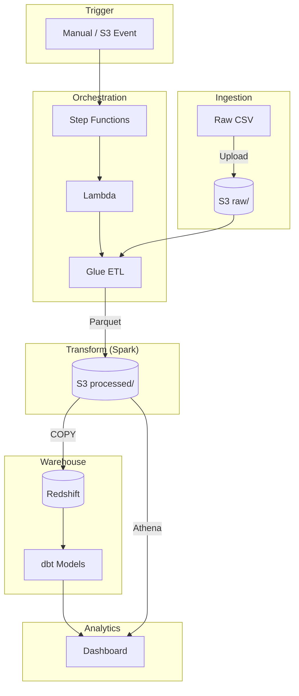
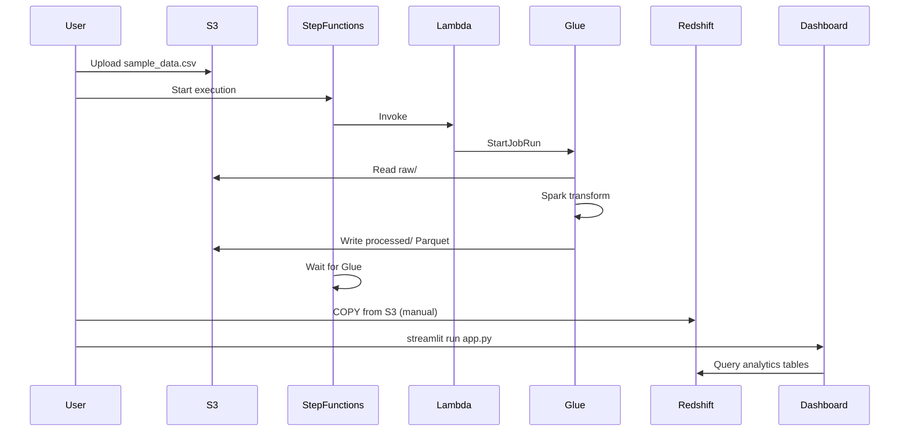

# AWS Data Pipeline — Sales Analytics

A complete, portfolio-ready AWS data pipeline demonstrating batch ingestion, Spark ETL, orchestration, data warehousing, and analytics dashboards.

---

## 1. Project Title & Problem Description

### Title
**AWS Data Pipeline — End-to-End Sales Analytics**

### Problem Description

**Dataset:** Sample retail sales data (`data/sample_data.csv`) with 10 transactions across product categories (Electronics, Home, Hardware, Books). Each row includes product, category, quantity, unit price, and sale date.

**Goal:** Build a production-style pipeline that:
1. Ingests raw CSV into S3
2. Transforms data with Spark (Glue) — aggregate revenue by category and time
3. Stores processed Parquet in S3
4. Loads into a data warehouse (Redshift) with partitioned tables
5. Transforms with dbt for analytics
6. Visualizes with a two-tile dashboard (time-based + categorical)

**Business Value:** Enables stakeholders to analyze sales trends over time and by category for decision-making.

---

## 2. Architecture Diagram





---

## 3. Technologies Used

| Layer | Technology |
|-------|------------|
| **Cloud** | AWS |
| **IaC** | Terraform |
| **Storage** | S3 (raw + processed) |
| **ETL** | AWS Glue (PySpark) |
| **Orchestration** | Step Functions, Lambda |
| **Data Warehouse** | Redshift Serverless (partitioned tables) |
| **Transformations** | dbt, Spark |
| **Query** | Athena (fallback), Redshift |
| **Dashboard** | Streamlit |

---

## 4. Setup Instructions

### Prerequisites

- Terraform 1.0+
- AWS CLI configured
- Python 3.10+
- dbt-core + dbt-redshift (for Redshift path)

### Step 1: Deploy Infrastructure

```bash
cd infrastructure/terraform
terraform init
terraform plan
terraform apply
```

### Step 2: Upload Sample Data

```bash
./scripts/upload_sample_data.sh
# Or: aws s3 cp data/sample_data.csv s3://$(terraform -chdir=infrastructure/terraform output -raw s3_bucket)/raw/
```

### Step 3: Run the Pipeline

```bash
./scripts/run_pipeline.sh
# Or: aws stepfunctions start-execution --state-machine-arn $(terraform -chdir=infrastructure/terraform output -raw state_machine_arn)
```

### Step 4: Run Glue Crawler (for Athena)

```bash
aws glue start-crawler --name data-pipeline-demo-crawler-processed
# Wait ~1 min, then run again to sync schema
```

### Step 5: (Optional) Redshift Setup

1. Enable Redshift Serverless in AWS Console (opt-in).
2. Apply with Redshift:
   ```bash
   terraform apply -var="enable_redshift=true" -var="redshift_admin_password='YourPassword'"
   ```
3. Run DDL: `psql -h <redshift_host> -U admin -d sales -f sql/redshift/01_ddl.sql`
4. Run COPY: `python scripts/copy_to_redshift.py` (set S3_BUCKET, REDSHIFT_IAM_ROLE_ARN in .env)
5. Run dbt: `cd dbt && dbt build`

### Step 6: Run Dashboard

```bash
cp .env.example .env
# Edit .env with terraform outputs (athena_results_bucket, glue_database, etc.)
pip install -r dashboard/requirements.txt
cd dashboard && streamlit run app.py
```

---

## 5. Data Flow Explanation

| Step | Source | Process | Destination |
|------|--------|---------|-------------|
| 1 | `data/sample_data.csv` | Upload | `s3://bucket/raw/` |
| 2 | S3 raw/ | Step Functions → Lambda → Glue | — |
| 3 | S3 raw/ | Glue PySpark: aggregate by category, year, month | `s3://bucket/processed/` (Parquet) |
| 4 | S3 processed/ | Redshift COPY (or Glue Crawler for Athena) | Redshift `raw.sales_processed` |
| 5 | Redshift raw | dbt: `stg_sales` → `fct_sales_by_category`, `fct_sales_over_time` | Redshift `analytics.*` |
| 6 | Athena/Redshift | Streamlit queries | Dashboard (2 tiles) |

---

## 6. Dashboard Preview

The dashboard has **two tiles**:

| Tile | Type | Chart | Data |
|------|------|-------|------|
| **Tile 1** | Time-based | Line chart | Revenue over time (by year/month) |
| **Tile 2** | Categorical | Bar chart | Revenue by category |

**Run locally:**
```bash
streamlit run dashboard/app.py
```

**Screenshot placeholder:** After running, open `http://localhost:8501` to view the dashboard.

---

## 7. Evaluation Criteria Mapping

| Category | Requirement | How This Project Meets It |
|----------|-------------|---------------------------|
| **Problem Description** | Clearly explain dataset and goal | §1: Dataset (10 rows, 4 categories), goal (pipeline for sales analytics), business value |
| **Cloud** | Use AWS with Terraform | §3, §4: Full AWS stack; `infrastructure/terraform/` deploys S3, Glue, Lambda, Step Functions, Athena, Redshift |
| **Data Ingestion** | Full batch or stream pipeline | §5: Batch pipeline: S3 → Glue → S3; Step Functions orchestrates |
| **Data Warehouse** | Use Redshift with partitioned tables | `sql/redshift/01_ddl.sql`: `raw.sales_processed` with `SORTKEY (year, month)`; Redshift Serverless in Terraform |
| **Transformations** | Use dbt or Spark | Spark: `glue/transform_job.py`; dbt: `dbt/models/*.sql` (stg, fct_sales_by_category, fct_sales_over_time) |
| **Dashboard** | Two tiles (categorical + time-based) | `dashboard/app.py`: Tile 1 = line chart (time), Tile 2 = bar chart (category) |
| **Reproducibility** | Clear setup and run instructions | §4: Step-by-step Terraform, upload, run pipeline, crawler, dashboard |

---

## 8. Future Improvements / Optional Enhancements

- **Streaming:** Add MSK (Kafka) + Glue Streaming for real-time ingestion
- **Scheduling:** EventBridge rule to run pipeline daily
- **S3 Trigger:** Lambda on S3 upload to auto-start pipeline
- **Redshift Spectrum:** Query S3 directly from Redshift (no COPY)
- **CI/CD:** GitHub Actions for Terraform apply on merge
- **Monitoring:** CloudWatch dashboards for Glue/Step Functions

---

## Project Structure

```
├── data/
│   └── sample_data.csv
├── glue/
│   └── transform_job.py
├── lambda/
│   └── trigger_glue.py
├── dbt/
│   ├── models/
│   │   ├── stg_sales.sql
│   │   ├── fct_sales_by_category.sql
│   │   └── fct_sales_over_time.sql
│   └── profiles.yml.example
├── step_functions/
│   └── state_machine_definition.json
├── sql/
│   └── redshift/
│       ├── 01_ddl.sql
│       └── 02_copy.sql
├── dashboard/
│   └── app.py
├── infrastructure/
│   └── terraform/
│       ├── main.tf
│       ├── athena.tf
│       ├── redshift.tf
│       ├── variables.tf
│       └── outputs.tf
├── scripts/
│   ├── upload_sample_data.sh
│   └── run_pipeline.sh
├── .env.example
├── Makefile
└── README.md
```

---

## License

MIT
